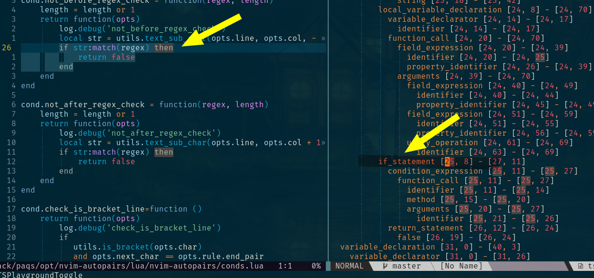

#Endwise (experiment)

I don't have time to add rule for all language.
so you can create your rule and make a PR. Thank

read docs in readme.md about rules first.

and install TSPlayground

``` lua
local npairs=require('nvim-autopairs')
npairs.setup()

-- clear all rule if you don't want to use autopairs
npairs.clear_rules()

```

``` lua
local endwise = require('nvim-autopairs.ts-rule').endwise

npairs.add_rules({
-- then$ is a lua regex
-- end is a match pair
-- lua is a filetype
-- if_statement is a treesitter name.  "" will skip check with treesitter
    endwise('then$', 'end', 'lua', 'if_statement')
})

```
-- run TSPlaygroudnToggle and get treesitter name



if that builtin endwise rule is not correct you can make your custom rule
conditon

take a look of that file and write your function

`lua/nvim-autopairs/ts-rule.lua`
`lua/nvim-autopairs/ts-conds.lua`
